# MEDICINE APP
App quản lý thuốc - bài tập giữa kỳ
## Tải dự án về
Mở folder cần chứa dự án, sau đó clone:
```
git clone https://github.com/Huynhngockhanh52/GKAPP.git
```
## Chạy dự án
 - Mở dự án bằng Netbean hoặc IntelliJ.
 - Chọn và chạy file Main.java: 
 - Đăng nhập với tài khoản là ***admin*** và mật khẩu là ***admin***
 <p align="center">
   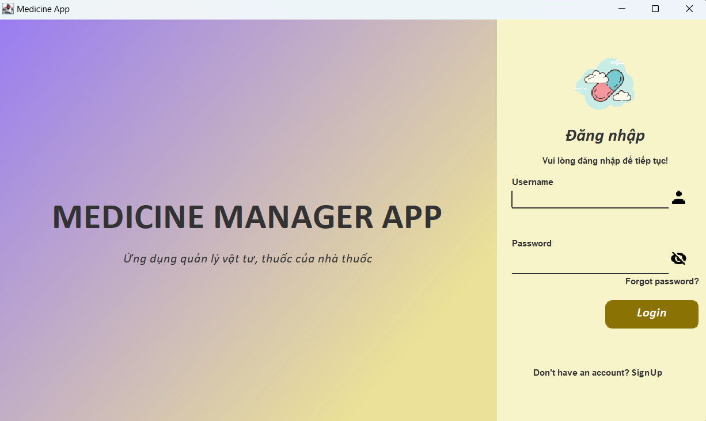
 </p>

## Giao diện chính:
- Giao diện chính của ứng dụng như sau:
  <p align="center">
    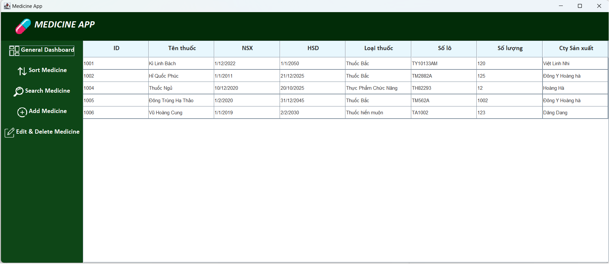
  </p>
- Ứng dụng bao gồm các chức năng được mô tả ở thanh taskbar bên trái, bao gồm các chức năng:
  + Sắp xếp
  + Tìm kiếm
  + Thêm
  + Chỉnh sửa hoặc xóa
- Giao diện sắp xếp:
  <p align="center">
    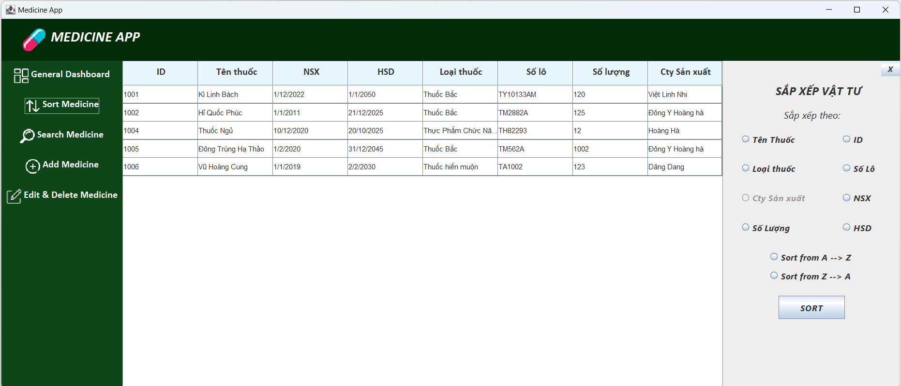
  </p>
- Giao diện tìm kiếm:
  <p align="center">
    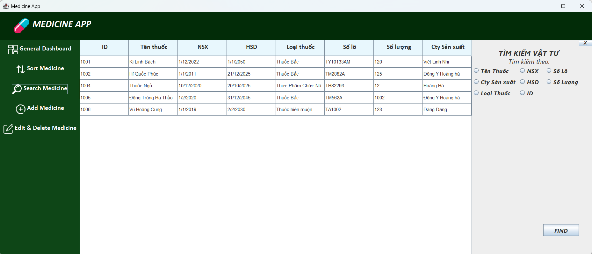
  </p>
- Giao diện thêm:
  <p align="center">
    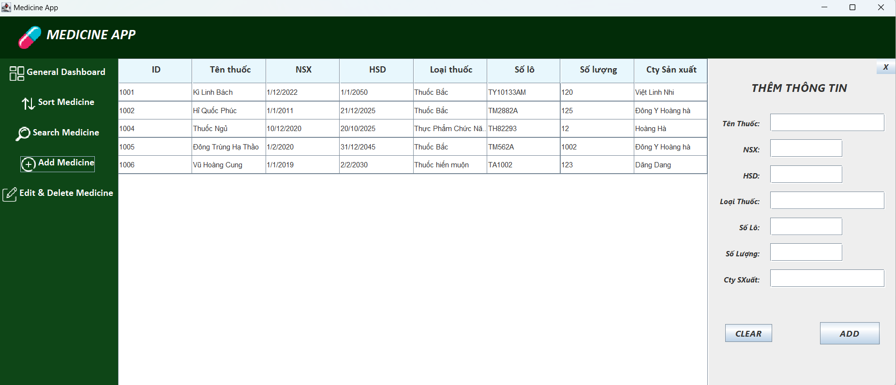
  </p>
- Giao diện chỉnh sửa và xóa:
  <p align="center">
    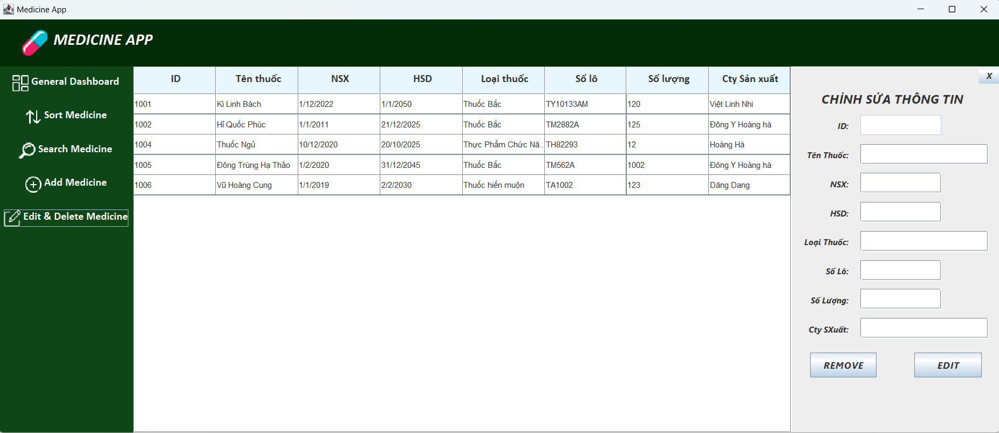
  </p>
## Các chức năng của ứng dụng:
- ### Chức năng Add Medicine:
  Khi nhấn vào button ***Add Medicine*** trong DashBoard thì giao diện thêm thông tin vật tư sẽ hiện ra
  <p align="center">
    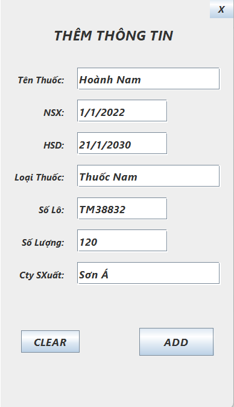
  </p>
  Nếu ta bỏ trống một thông tin nào, ứng dụng sẽ hiển thị thông báo lỗi với thông tin đó. 
  <p align="center">
    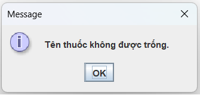
  </p>
  Đối với định dạng NSX, HSD, nếu ta nhập không đúng định dạng thì ứng dụng sẽ thông báo không đúng định dạng NSX, HSD. Định dạng đúng là: dd/mm/yyyy
  <p align="center">
    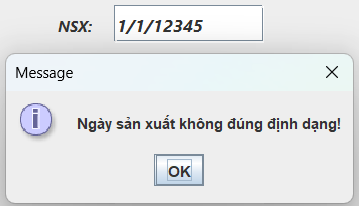
  </p>
  Chức năng sẽ tự động tạo ra ID khi người dùng thêm vào.
  
- ### Chức năng chỉnh sửa:
  Khi nhấn vào button ***Edit&Delete Medicine*** trong DashBoard thì giao diện chỉnh sửa và xóa thông tin vật tư sẽ hiện ra
  <p align="center">
    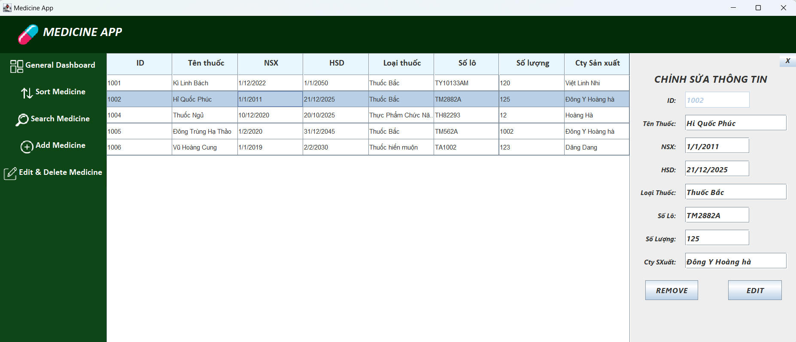
  </p>
  Khi người dùng muốn chỉnh sửa một vật tư nào đó, người dùng chỉ cần click vào vật tư muốn chỉnh sửa trong bảng, sau đó giao diện Edit sẽ tự động cập nhật, từ đó người dùng có thể chỉnh sửa hoặc xóa sản phẩm nào đó. 
  <p align="center">
   
  </p>
 Tương tự như ***Add Medicine***, người dùng nếu bỏ trống một vùng nhập nào thì ứng dụng sẽ hiện thông báo đến người dùng
- ### Chức năng sort:
 Khi nhấn vào button ***Sort Medicine*** trong DashBoard thì giao diện sắp xếp thông tin vật tư sẽ hiện ra
  <p align="center">
    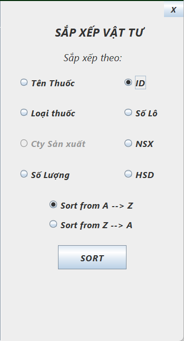
  </p>
  Chức năng sắp xếp vật tư chỉ cho chọn sắp xếp theo một loại dữ liệu nào đó và sắp xếp theo thứ tự tăng dần hoặc giảm dần.
  
- ### Chức năng search:
 Khi nhấn vào button ***Search Medicine*** trong DashBoard thì giao diện tìm kiếm thông tin vật tư sẽ hiện ra
  <p align="center">
    
  </p>
  Chức năng tìm kiếm vật tư sẽ cho phép người dùng chọn nhiều loại dữ liệu (ID, tên, loại, NSX, HSD, ...) và thực hiện tìm kiếm bằng cách tìm xem trong các trường đó có chứa thông tin cần tìm kiếm đó không.
  Khi người dùng nhấn chọn tìm kiếm theo một loại nào thì trường nhập tìm kiếm sẽ hiện ra như trong hình sau:
  <p align="center">
    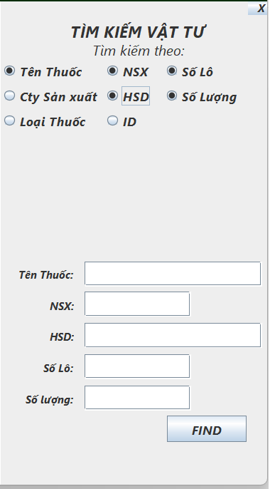
  </p>
  
## Chú ý: 
- ### Ứng dụng hiện đang chạy ổn định trên Intellij IDEA, hiện tại chưa chạy thử trên Netbean và có thể dẫn đến lỗi khi chạy trên đó!
- ### Ứng dụng sử dụng các library sau:
  + #### Thư viện javax.xml.bind, version: 2.3.1 và 4.0
  + #### Thư viện miglayout, version 4.0
  + #### Thư viện TimingFramework, version 0.55
 
